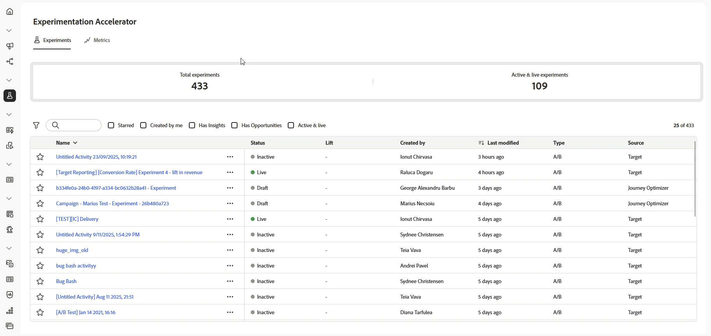

# Acelerador de experimentação do Journey Optimizer

>[!AVAILABILITY]
>
>O **Acelerador de experimentação do Journey Optimizer** precisa de uma licença paga para os clientes e ele integra-se perfeitamente ao Adobe Target ou ao Adobe Journey Optimizer.

O **Acelerador de experimentação do Journey Optimizer** é uma ferramenta potente criada para simplificar e aprimorar o processo de experimentação. Graças à integração com o Adobe Target e o Adobe Journey Optimizer, ele fornece uma plataforma centralizada para gerenciar, analisar e otimizar experimentos. Ao utilizar insights impulsionados pela IA e testes adaptáveis, o acelerador de experimentação do Journey Optimizer permite tomar decisões orientadas por dados, melhorar estratégias de marketing e gerar resultados mensuráveis.

Os principais benefícios incluem:

* **Experimentação mais rápida**: execute testes adaptáveis e sempre ativos com modelos que se ajustam ao longo do tempo.
* **Plataforma unificada**: gerencie todos os experimentos do Adobe Target e do Journey Optimizer no mesmo lugar.
* **Insights impulsionados pela IA**: mostre automaticamente os principais resultados, impulsionadores de desempenho e novas oportunidades.
* **Direcionamento mais inteligente**: use dados comportamentais e de conteúdo para priorizar experimentos de alto impacto.
* **Monitoramento de KPIs**: controle métricas como aumento e confiança em experimentos.
* **Colaboração fluida**: compartilhe resultados facilmente e gerencie funções de equipes com alertas em tempo real.

<table style="table-layout:fixed">
<tr style="border: 0; text-align: center;">
<td> <a href="../start/experiment-accelerator-access.md">Introdução ao acelerador de experimentação do Journey Optimizer</a></td>
<td> <a href="../start/experiment-accelerator-best-practices.md">Práticas recomendadas para o acelerador de experimentação do Journey Optimizer</a></td>
<td> <a href="../track/experiment-accelerator-monitor.md">Acompanhe e monitore o desempenho dos seus experimentos</a></td>
</tr>
</table>
