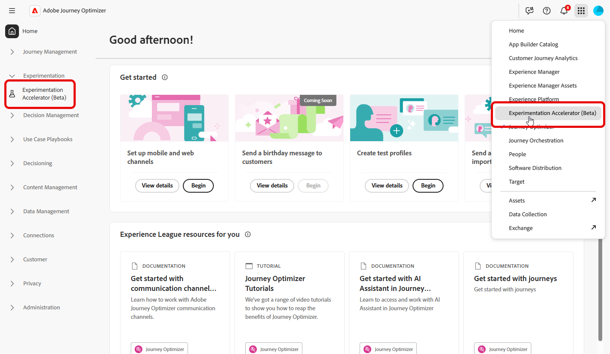
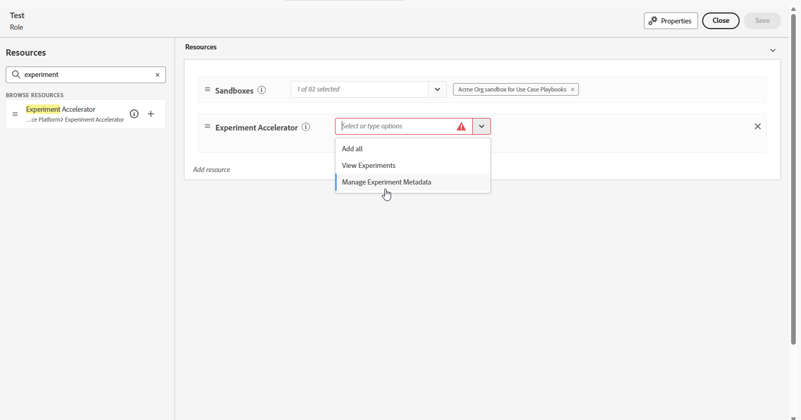
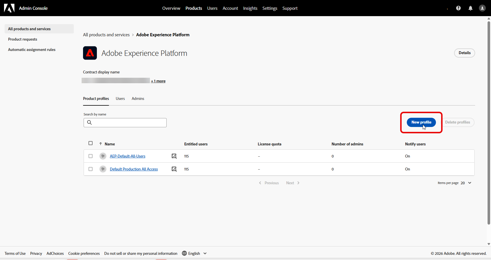
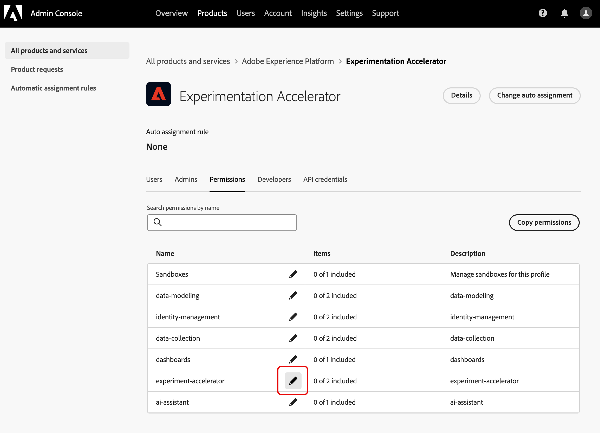
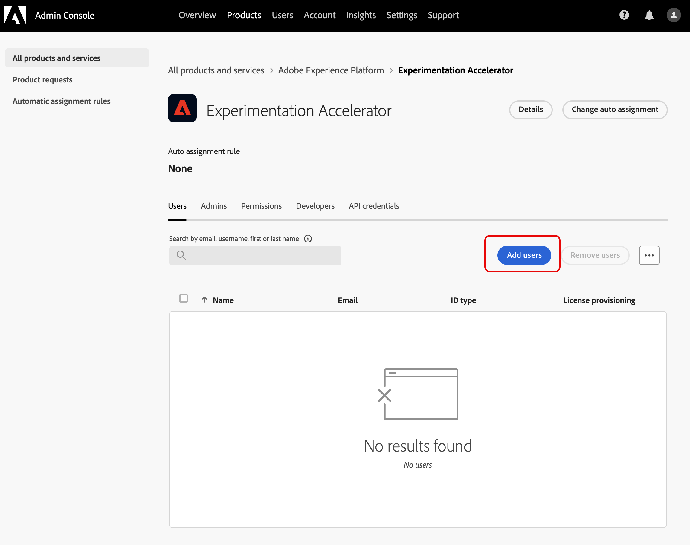

# Acessar o acelerador de experimentação do Journey Optimizer

Depois de [criar e configurar seu experimento](https://experienceleague.adobe.com/en/docs/journey-optimizer/using/content-management/content-experiment/content-experiment) e enviar suas campanhas ou jornadas aos seus perfis, você pode acessar o **[!UICONTROL Journey Optimizer Experimentation Accelerator]** para se aprofundar no desempenho do seu experimento.

Você pode acessar o **[!UICONTROL Journey Optimizer Experimentation Accelerator]** no menu suspenso [!UICONTROL Experimentação] ou pelo alternador Aplicativos. Observe que os usuários somente com uma licença do Target podem acessá-la somente por meio do alternador de Aplicativos.

Os experimentos disponíveis dependem da configuração do:

* **Para usuários do Adobe Journey Optimizer**: os experimentos configurados na sandbox da sua organização habilitada são incluídos automaticamente.

* **Para usuários do Adobe Target com Journey Optimizer**: qualquer atividade A/B no Target aparece em **[!UICONTROL Journey Optimizer Experimentation Accelerator]** na sandbox de produção do Journey Optimizer.

* **Para usuários somente do Adobe Target**: todas as atividades A/B na sua organização do Target são incluídas na sandbox de produção do Journey Optimizer.

Para usar o **[!UICONTROL Journey Optimizer Experimentation Accelerator]**, você precisa acessar a sandbox e a seguinte permissão relacionada:

* **[!UICONTROL Exibir experimentos]**
* **[!UICONTROL Gerenciar metadados do experimento]**

+++ Saiba como atribuir permissões relacionadas ao experimento com uma licença do Adobe Experience Platform ou do Adobe Jornada Otimizer

1. No produto **[!DNL Permissions]**, vá para a guia **[!UICONTROL Funções]** e selecione a **[!UICONTROL Função]** desejada.

1. Clique em **[!UICONTROL Editar]** para modificar as permissões.

1. Adicione o recurso **[!UICONTROL Acelerador de experimentos]** e selecione **[!UICONTROL Exibir experimentos]** e/ou **[!UICONTROL Gerenciar metadados de experimentos]** no menu suspenso.

   

1. Clique em **[!UICONTROL Salvar]** para aplicar as alterações.

As permissões de todos os usuários já atribuídos a essa função serão atualizadas automaticamente.

Para atribuir esta função a novos usuários:

1. Navegue até a guia **[!UICONTROL Usuários]** no painel Funções e clique em **[!UICONTROL Adicionar usuário]**.

1. Insira o nome do usuário, seu endereço de email ou escolha na lista e clique em **[!UICONTROL Salvar]**.

   Se o usuário não tiver sido criado anteriormente, consulte [esta documentação](https://experienceleague.adobe.com/pt-br/docs/experience-platform/access-control/abac/permissions-ui/users).

O usuário receberá um email com instruções para acessar a sua instância.

+++

 

+++ Saiba como atribuir permissões relacionadas ao experimento com uma licença do Adobe Target

1. Abra o **[Admin Console](http://adminconsole.adobe.com/)**.

1. Em **[!UICONTROL Produtos]**, escolha **[!UICONTROL Adobe Experience Platform]**.

1. Clique em **[!UICONTROL Novo Perfil]**.

   

1. Insira um **[!UICONTROL Nome]** e uma **[!UICONTROL Descrição]** para o perfil e clique em **[!UICONTROL Salvar]**.

1. Abra o **[!UICONTROL Perfil]** recém-criado e navegue até a guia **[!UICONTROL Permissões]**.

1. Clique em  ao lado da permissão **[!UICONTROL acelerador de experimentação]**.

   

1. Adicione as permissões que este perfil deve ter, como **[!UICONTROL Exibir experimentos]** e **[!UICONTROL Gerenciar metadados de experimentos]**, e clique em **[!UICONTROL Salvar]**.

   >[!TIP]
   >
   > Crie perfis separados quando os usuários precisarem de diferentes níveis de acesso. Por exemplo, crie um perfil de **[!UICONTROL Visualizador do Experimentation Accelerator]** com apenas **[!UICONTROL Exibir experimentos]** e um perfil do **[!UICONTROL Editor do Experimentation Accelerator]** com **[!UICONTROL Exibir experimentos]** e **[!UICONTROL Gerenciar metadados de experimentos]**.

   

1. Na guia **[!UICONTROL Permissões]**, selecione **[!UICONTROL Sandboxes]**.

1. Adicione as sandboxes em que os usuários devem poder usar o Journey Optimizer Experimentation Accelerator e clique em **[!UICONTROL Salvar]**.

1. Abra a guia **[!UICONTROL Usuários]** e clique em **[!UICONTROL Adicionar usuários]**.

   

1. Adicione os usuários que devem receber esse acesso e clique em **[!UICONTROL Salvar]**.

Os usuários adicionados a este perfil agora podem acessar o Journey Optimizer Experimentation Accelerator pelo alternador de aplicativos.

+++

<!--
table style="table-layout:fixed"><tr style="border: 0;">
<td>

<strong><a href="experiment-accelerator-overview.md">Overview</a></strong>

</td>
<td>

<strong><a href="experiment-accelerator-monitor.md">Experiments</a></strong>

</td>
<td>

<strong><a href="experiment-accelerator-metrics.md">Metrics</a></strong>

</td>
</tr></table
-->
